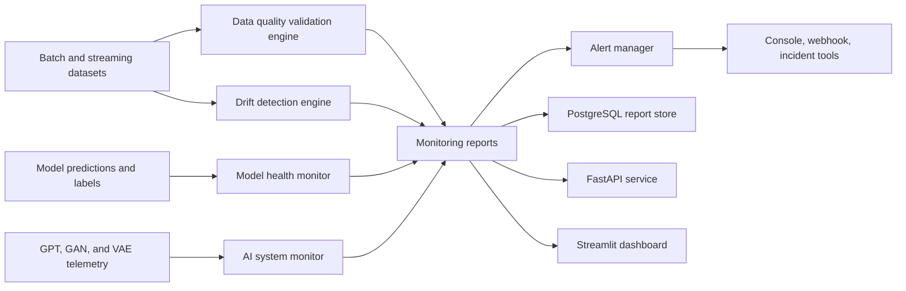
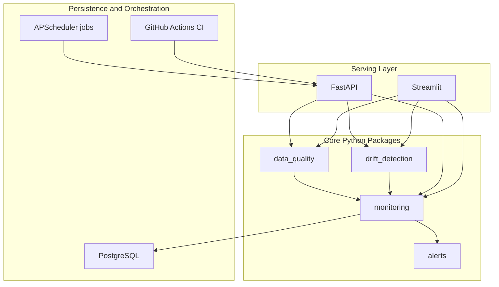
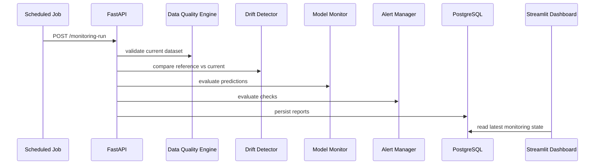

# Architecture

## System Overview

## Runtime Components

## Data Flow

## Design Principles

- Core checks run locally with deterministic Pandas/NumPy/SciPy logic.
- Great Expectations and Evidently AI are optional adapters for teams that already maintain expectation suites or HTML drift reports.
- PySpark frames are accepted through `toPandas()` for validation paths where data volumes have already been sampled or profiled upstream.
- Every engine returns a common `MonitoringReport` object so API, dashboard, storage, and alerting integrations can compose reports consistently.
- Thresholds are explicit, versioned, and configurable through code or `config/settings.yaml`.

## Enterprise Extension Points

- Replace `ConsoleAlertChannel` with Slack, PagerDuty, ServiceNow, or Teams channels.
- Persist reports through `monitoring.storage.ReportStore` using `DATABASE_URL`.
- Add model registry metadata to `MonitoringReport.metadata`.
- Run high-volume drift checks in Spark and pass aggregated feature profiles into the same report contract.
- Export reports to object storage for audit and regulatory retention.

